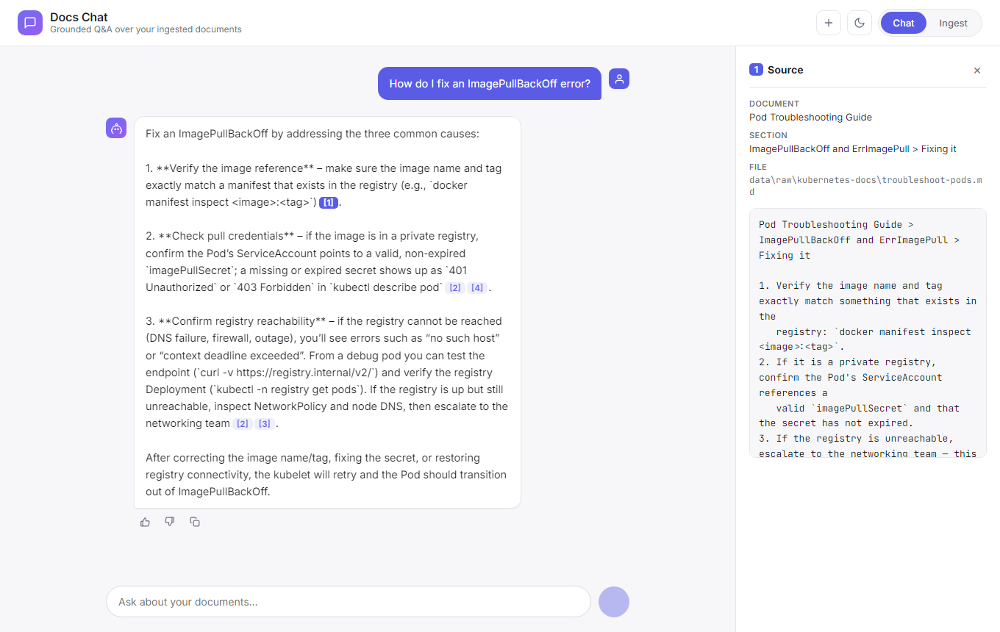
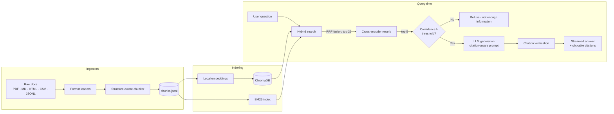
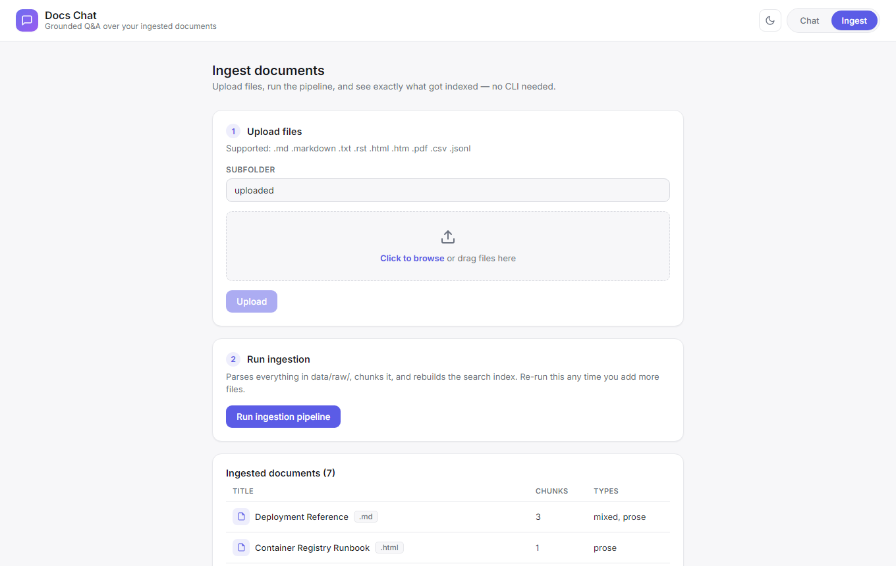
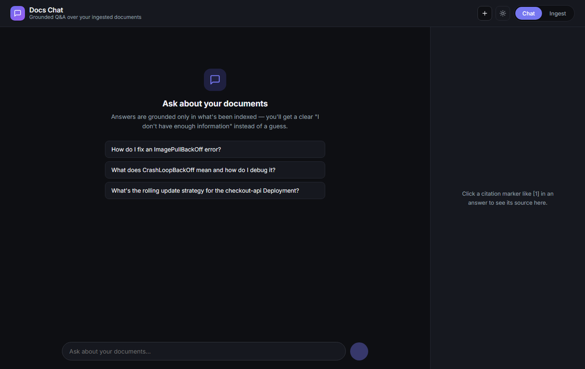

# 🧠 RAG Document Search System

[](https://www.python.org/)
[](https://react.dev/)
[](https://fastapi.tiangolo.com/)
[](https://www.trychroma.com/)
[](LICENSE)

A chat interface for querying messy real-world technical documentation —
mixed PDFs, Markdown, and wikis — with a **source citation on every answer**
and a **custom evaluation suite** to measure retrieval and answer accuracy.

Answers are grounded **only** in what's been ingested. Every factual claim
carries an inline citation you can click to inspect the exact source chunk,
and when the retrieved context isn't good enough the app says *"I don't have
enough information"* instead of guessing.

<p align="center">
  
</p>

<p align="center">
  <sub>Light and dark mode, source citations, and an in-app ingestion pipeline — see <a href="#screenshots">more screenshots</a> below.</sub>
</p>

---
### Walkthrough Video Link: https://youtu.be/V_MIaQOuNIY
---

## Table of contents

- [Why this exists](#why-this-exists)
- [Features](#features)
- [Architecture](#architecture)
- [Tech stack](#tech-stack)
- [Quick start](#quick-start)
- [Getting data](#getting-data)
- [Configuration](#configuration)
- [Evaluation](#evaluation)
- [API reference](#api-reference)
- [Project layout](#project-layout)
- [Screenshots](#screenshots)
- [Known limitations](#known-limitations)
- [Roadmap](#roadmap)
- [License](#license)

## Why this exists

Most RAG demos run on a handful of clean markdown files and quietly fall
apart on real documentation — inconsistent headings, tables, embedded code
blocks, scanned PDFs, CSV exports, half-finished wiki pages. This project is
built and evaluated against **messy, real, multi-format docs on purpose**,
with the failure modes (empty files, unsupported formats, low-confidence
retrieval) surfaced instead of hidden.

The entire default stack is **free and runs locally** — no paid API required
except a free [Groq](https://console.groq.com/keys) key for the LLM (no
credit card).

## Features

| Capability | How it's done |
|---|---|
| **Ingestion** | Format-specific loaders (Markdown, text/rst, HTML, PDF, CSV, JSONL) → a common `Document` shape. Per-file error logging, near-duplicate detection, and an end-of-run report (`N parsed / N failed / breakdown by reason`). |
| **Chunking** | Structure-aware: splits on heading boundaries, never cuts a fenced code block or a Markdown table, ~15% overlap on oversized sections. Every chunk is prefixed with `{doc title} > {section path}` so it stands on its own. |
| **Retrieval** | Hybrid BM25 + vector search fused with Reciprocal Rank Fusion. Exact technical strings (`ImagePullBackOff`, `getUserById()`) that pure semantic search blurs are exactly what BM25 catches. Optional metadata filtering by document. |
| **Reranking** | A cross-encoder reranks the top ~25 candidates down to the top 5 that actually get sent to the LLM. |
| **Generation** | Citation-aware system prompt, context-only answering, explicit "not enough information" path. |
| **Guardrails** | If the top reranker score is below `CONFIDENCE_THRESHOLD`, the LLM is never called — the app refuses immediately. After generation, every `[n]` the model emitted is checked against the context actually sent; hallucinated markers are flagged and rendered as plain text, not links. |
| **UI** | React + Vite chat interface — streaming answers, light/dark themes, a click-to-inspect citation side panel, copy-to-clipboard, thumbs up/down feedback, and an Ingest tab to upload files and re-run the pipeline without touching the CLI. |
| **Eval** | A harness that measures retrieval and generation separately and prints a progression table: vector-only baseline → hybrid → hybrid + rerank. |

Every provider sits behind an abstraction — swap embeddings, reranking, or
the generation LLM by editing `.env`; nothing downstream changes.

## Architecture



Full request flow, in words:

```
query
  ├─ hybrid search: BM25 ranking + vector ranking  ->  RRF fusion  ->  top 25
  ├─ cross-encoder rerank                            ->  top 5
  ├─ top score < CONFIDENCE_THRESHOLD?  ->  refuse, don't call the LLM
  ├─ build context block with [1]..[5] citation IDs  ->  stream from the LLM
  └─ verify every [n] the model emitted exists in the context that was sent
       valid   -> clickable citation opening the source chunk in the side panel
       invalid -> flagged as hallucinated, rendered as plain text
```

## Tech stack

| Layer | Default | Cost | Swappable for |
|---|---|---|---|
| Embeddings | `BAAI/bge-small-en-v1.5` via `sentence-transformers`, local CPU | Free | Voyage, OpenAI |
| Reranker | `BAAI/bge-reranker-base` cross-encoder, local CPU | Free | Cohere |
| Vector store | ChromaDB, local on-disk | Free | — |
| Keyword search | `rank-bm25` | Free | — |
| LLM generation | Groq (`openai/gpt-oss-120b`) | Free tier | Gemini, OpenAI, Anthropic |
| Backend | FastAPI + Uvicorn | Free | — |
| Frontend | React 18 + Vite | Free | — |

See `.env.example` for every provider option.

## Quick start

**Requirements:** Python 3.10+, Node 18+, and a free [Groq API key](https://console.groq.com/keys).

```powershell
# Backend — Windows PowerShell
python -m venv .venv
.\.venv\Scripts\Activate.ps1
pip install -r requirements.txt
Copy-Item .env.example .env
# then edit .env and set GROQ_API_KEY
```

```bash
# Backend — macOS / Linux
python -m venv .venv && source .venv/bin/activate
pip install -r requirements.txt
cp .env.example .env
# then edit .env and set GROQ_API_KEY
```

```bash
# Frontend
cd frontend
npm install
cp .env.example .env       # Copy-Item .env.example .env on PowerShell
cd ..
```

First run downloads the two local models (~150 MB total) from Hugging Face;
after that they work offline.

**Run it:**

```bash
# 1. Ingest + chunk everything in data/raw/  ->  data/processed/chunks.jsonl
python -m ingest.pipeline

# 2. Build the hybrid search index (embeds every chunk locally)
python -m retrieval.search --build

# 3. Sanity-check retrieval from the CLI (hybrid search, no reranking)
python -m retrieval.search --query "how do I fix ImagePullBackOff"

# 4. Start the API  ->  http://localhost:8000  (docs at /docs)
uvicorn api.main:app --reload --port 8000

# 5. In another terminal, start the frontend  ->  http://localhost:5173
cd frontend && npm run dev
```

Once the backend is up, the **Ingest** tab in the UI can upload files and
re-run steps 1–2 for you — no CLI needed.

## Getting data

See [`data/README.md`](data/README.md) for exact download commands. Put real,
messy, multi-format docs in `data/raw/<source-name>/` (Kubernetes docs, AWS
whitepaper PDFs, a Stack Exchange dump, etc.). **Don't** use a clean demo
dataset — handling the mess is the point of the project.

## Configuration

All settings are read once from `.env` through `config.py`. The ones you're
most likely to touch:

| Variable | Default | Meaning |
|---|---|---|
| `LLM_PROVIDER` | `groq` | `groq` \| `gemini` \| `openai` \| `anthropic` |
| `GROQ_API_KEY` | — | Required for generation with the default provider |
| `EMBEDDING_PROVIDER` | `local` | `local` \| `voyage` \| `openai` |
| `RERANK_PROVIDER` | `local` | `local` \| `cohere` |
| `RETRIEVAL_TOP_K` | `25` | Candidates pulled by hybrid search |
| `RERANK_TOP_K` | `5` | Chunks kept after reranking / sent to the LLM |
| `CONFIDENCE_THRESHOLD` | `0.15` | Below this top score, refuse without calling the LLM |
| `MAX_CHUNK_TOKENS` | `500` | Target chunk size (≈4 chars/token estimate) |
| `CHUNK_OVERLAP_RATIO` | `0.15` | Overlap carried between oversized-section chunks |
| `CHROMA_PERSIST_DIR` | `./data/chroma` | On-disk vector + BM25 index location |

> `CONFIDENCE_THRESHOLD` is compared against the cross-encoder rerank score
> when reranking is on, and against the raw RRF fused score otherwise — those
> are different scales, so tune it against your real data.

## Evaluation

```bash
# Fill in eval/testset.json with real questions about your real data first —
# the shipped file is a 5-question template, not a real eval set.
python -m eval.run_eval                    # all three stages
python -m eval.run_eval --stage reranked   # just the final stage
python -m eval.run_eval --testset path/to/other.json
```

Prints a progression table (vector-only → hybrid → reranked) and writes
`eval/results.json`. Generation only runs on the `reranked` stage (it's the
part that costs API calls), so that stage needs `GROQ_API_KEY` set. The
retrieval-only stages measure Recall@k and MRR.

The correctness and citation checks are deliberately crude (keyword overlap,
substring match) so the harness runs for free. Swap in an LLM-as-judge call or
`ragas` in `eval/run_eval.py` once the basics work.

## API reference

| Method | Path | Purpose |
|---|---|---|
| `POST` | `/ingest/upload` | Save uploaded files into `data/raw/<subfolder>/` |
| `POST` | `/ingest/run` | Run the pipeline, then rebuild the search index |
| `GET` | `/sources` | List ingested documents (title, chunk count, content types) |
| `POST` | `/chat` | Ask a question; response streams as Server-Sent Events |
| `POST` | `/feedback` | Log a thumbs up/down on an answer |
| `GET` | `/health` | Liveness check |

Interactive docs are served by FastAPI at `/docs` once the backend is running.

## Project layout

```
rag-docs/
├── config.py               # all env-driven settings, read in one place
├── ingest/
│   ├── loaders.py           # format-specific parsers -> common Document
│   ├── chunker.py           # heading/code/table-aware structural chunking
│   └── pipeline.py          # load -> chunk -> write, with error logging + dedupe
├── retrieval/
│   ├── embeddings.py        # local (free) + Voyage/OpenAI embedding providers
│   ├── search.py            # hybrid BM25 + vector search, RRF fusion, --build CLI
│   └── rerank.py            # local (free) + Cohere reranking providers
├── generation/
│   ├── llm_client.py        # Groq (free) + Gemini/OpenAI/Anthropic providers
│   ├── prompts.py           # citation-aware system prompt + context builder
│   └── answer.py            # confidence guardrail + citation verification, streaming
├── api/
│   └── main.py              # FastAPI: /chat (SSE), /ingest/*, /sources, /feedback, /health
├── eval/
│   ├── testset.json         # question set (template — replace with real questions)
│   └── run_eval.py          # Recall@k, MRR, answer correctness, citation + refusal accuracy
├── frontend/                # React + Vite chat UI, citation side panel, ingest view
└── data/
    ├── raw/                 # exactly what you downloaded, untouched (gitignored)
    └── processed/           # chunks.jsonl, written by ingest/pipeline.py (gitignored)
```

## Screenshots

<table>
<tr>
<td width="50%">

**Grounded answer with citations**

</td>
<td width="50%">

**In-app ingestion pipeline**

</td>
</tr>
<tr>
<td width="50%" colspan="2">

**Dark mode**

</td>
</tr>
</table>

## Known limitations

- **Scanned / image-only PDFs are skipped and logged**, not OCR'd. Wire in
  `pytesseract` in `ingest/loaders.py:load_pdf` if you need them.
- **Full index rebuild on every ingest** — no incremental re-embedding of only
  changed files.
- **Eval correctness is keyword matching**, not semantic judging — good enough
  to catch a wildly wrong or empty answer, not subtle factual errors.
- **Single-turn retrieval** — conversation history is passed to the LLM, but
  the retrieval query is the raw latest message (no "what about the other
  one?" rewriting).
- **No access control** on documents.

## Roadmap

- [ ] Incremental re-indexing (only re-embed changed files)
- [ ] Multi-turn query rewriting
- [ ] Query routing (lookup vs. summarization questions)
- [ ] Per-user access control on documents
- [ ] Cost / latency tracking per query
- [ ] OCR support for scanned PDFs

## License

[MIT](LICENSE) © Aymen Baig
